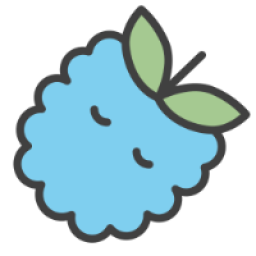
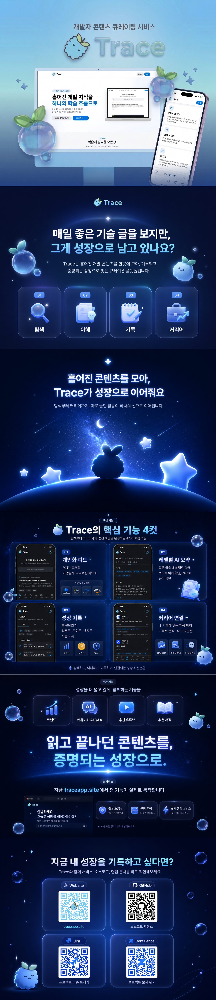
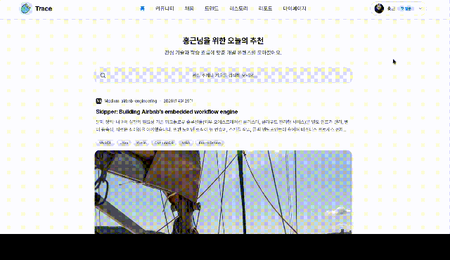
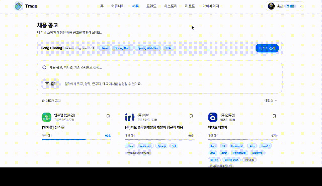
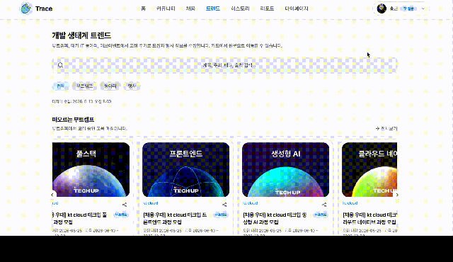
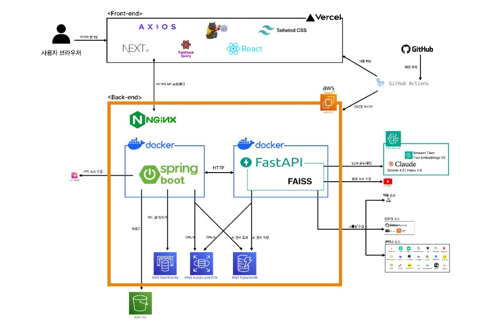

# Trace

흩어진 기술 콘텐츠와 채용 정보를 한곳에 모아, 학습부터 취업 준비까지 이어주는 개발자 성장 플랫폼입니다.

 

<a href="https://traceapp-orcin.vercel.app/">
  <strong>Trace 서비스 바로가기</strong>
</a>

 
 

<code>https://traceapp-orcin.vercel.app/</code>

## Service Preview

Trace는 여러 기술 블로그, 커뮤니티, 영상, 채용 공고를 수집하고 정규화한 뒤 사용자의 관심사에 맞게 보여줍니다. 콘텐츠를 읽는 데서 끝나지 않고 레벨별 AI 요약, 문서 근거 기반 질의응답, 주간 트렌드 분석, 이력서와 모의면접 기능까지 연결해 학습 기록이 실제 취업 준비로 이어지도록 설계했습니다.

## Screen Demos

<table>
  <tr>
    <td width="33%" valign="top">
      
      <h3>기술 콘텐츠 수집과 AI 요약</h3>
      
여러 기술 블로그와 커뮤니티 글을 한곳에 모아 보여주고, 글 상세 화면에서 레벨별 요약과 맞춤형 AI 기능으로 학습을 이어갑니다.

    </td>
    <td width="33%" valign="top">
      
      <h3>채용 공고 매칭</h3>
      
이력서의 기술 스택과 채용 공고를 비교해 매칭도를 제공하고, 관심 공고를 탐색하며 취업 준비 흐름으로 연결합니다.

    </td>
    <td width="33%" valign="top">
      
      <h3>트렌드와 활동 리포트</h3>
      
개발 생태계 트렌드와 개인 학습 활동을 시각화해 최신 흐름과 학습 기록을 함께 확인할 수 있습니다.

    </td>
  </tr>
</table>

## What We Build

- 여러 출처의 기술 콘텐츠 수집 및 공통 스키마 정규화
- 관심 기술 기반 개인화 피드와 콘텐츠 추천
- 레벨별 AI 요약, 퀴즈, 근거 기반 질의응답
- 주간 기술 트렌드 분석과 학습 활동 리포트
- 채용 공고 매칭, 이력서 관리, 면접 Q&A와 모의면접

## Architecture

Trace는 Next.js 프론트엔드, Spring Boot 백엔드, FastAPI AI 서버로 구성됩니다. 운영 환경에서는 프론트엔드를 Vercel에서 제공하고, 브라우저의 API 요청은 Nginx를 거쳐 Spring Boot로 전달됩니다. AI 요약과 RAG 답변은 FastAPI가 Amazon Bedrock, DynamoDB, FAISS 인덱스를 활용해 처리합니다.

## Project Management

Trace는 Jira 기반 WBS로 기능 단위 작업을 나누고, 백로그, 진행 상태, 담당자, 우선순위를 추적하며 개발했습니다. 주요 설계 결정, 트러블슈팅 기록, 회의 내용은 Confluence에 남겨 팀원이 같은 맥락을 공유할 수 있도록 했습니다. 이를 통해 프론트엔드, 백엔드, AI, 인프라 작업이 분리되어 있어도 일정과 이슈를 한 흐름에서 관리했습니다.

👉 [전체 Jira WBS 원본 이미지 보기](https://raw.githubusercontent.com/Devpick-Org/.github/master/profile/assets/jira-wbs.png)

👉 [Confluence 문서 모음 PDF 다운로드](https://raw.githubusercontent.com/Devpick-Org/.github/master/profile/assets/confluence.pdf)

Confluence 문서에는 PRD, 서비스 개요, 회의록, 설계 문서, 트러블슈팅 기록 등 프로젝트 진행 과정에서 작성한 주요 산출물을 함께 정리했습니다.

## Repositories

| Repository | Role |
| --- | --- |
| [devpick-frontend](https://github.com/Devpick-Org/devpick-frontend) | Next.js 기반 사용자 웹 애플리케이션 |
| [devpick-backend](https://github.com/Devpick-Org/devpick-backend) | Spring Boot 기반 API 서버 |
| [devpick-ai](https://github.com/Devpick-Org/devpick-ai) | FastAPI 기반 수집, 요약, RAG, 트렌드 분석 서버 |
| [devpick-infra](https://github.com/Devpick-Org/devpick-infra) | 인프라와 배포 설정 |

## Tech Stack

| Area | Stack |
| --- | --- |
| Frontend | Next.js, React, TypeScript, Tailwind CSS, TanStack Query, Axios |
| Backend | Spring Boot, Java, JPA, PostgreSQL, Redis |
| AI | FastAPI, Python, Amazon Bedrock, Claude, Titan Embeddings, FAISS |
| Data | PostgreSQL, DynamoDB, ElastiCache Redis, S3 |
| Infra | AWS EC2, Docker, Nginx, GitHub Actions, Vercel |

## Team

DevPick is building Trace as a capstone project focused on practical developer learning, technical content discovery, and career preparation.

<table>
  <tr>
    <td align="center" width="180">
      
       
      <strong>김홍근</strong>
       
      PM / Backend Lead
       
      <a href="https://github.com/khg9859">@khg9859</a>
    </td>
    <td align="center" width="180">
      
       
      <strong>박하영</strong>
       
      Backend
       
      <a href="https://github.com/nYeonG4001">@nYeonG4001</a>
    </td>
    <td align="center" width="180">
      
       
      <strong>조수헌</strong>
       
      AX
       
      <a href="https://github.com/suheon98">@suheon98</a>
    </td>
    <td align="center" width="180">
      
       
      <strong>홍보민</strong>
       
      Frontend
       
      <a href="https://github.com/uiuuoq">@uiuuoq</a>
    </td>
  </tr>
</table>
