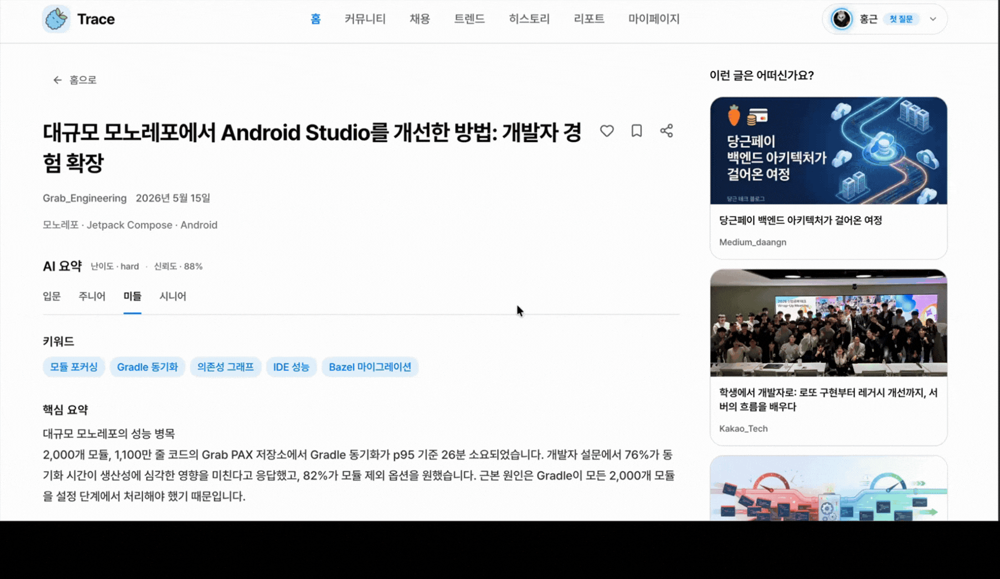
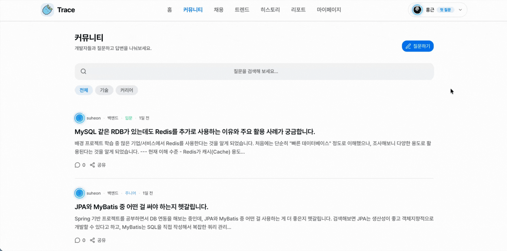
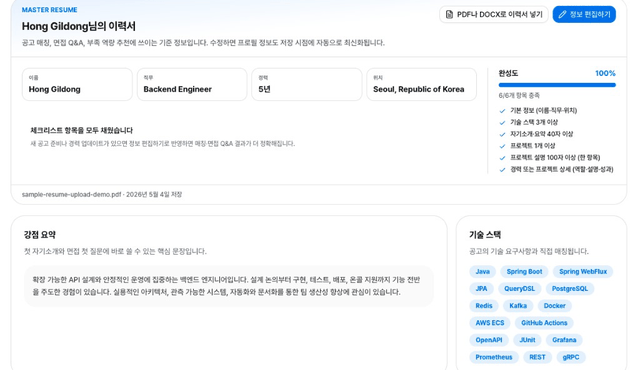
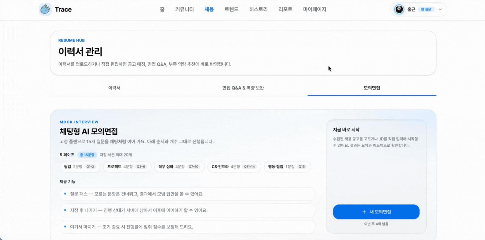
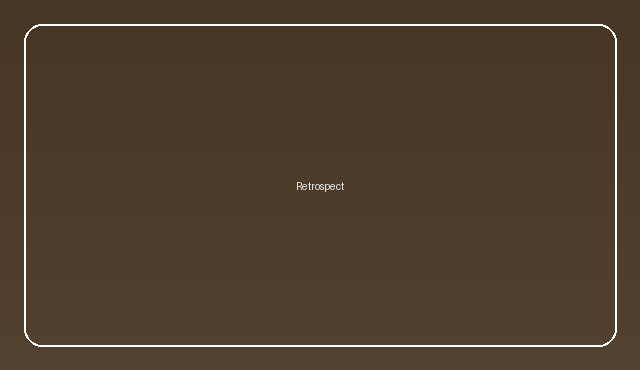
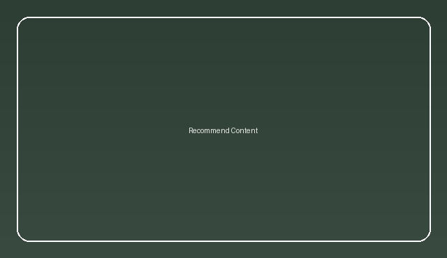
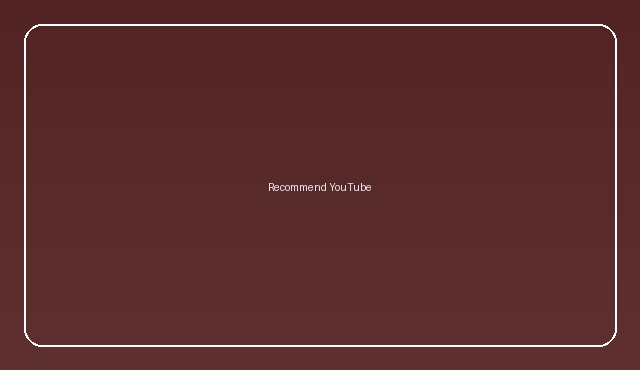
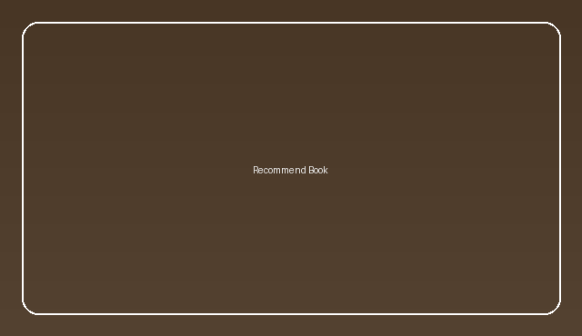
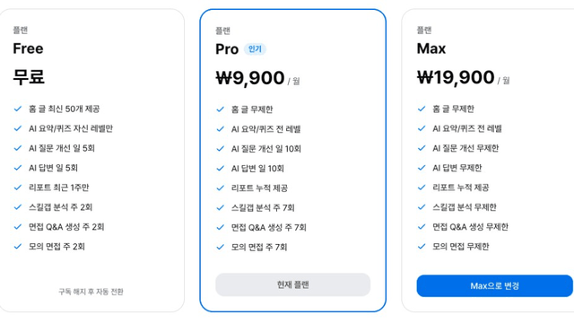

# Trace

흩어진 기술 콘텐츠와 채용 정보를 한곳에 모아, 학습부터 취업 준비까지 이어주는 개발자 성장 플랫폼입니다.

 

<a href="https://traceapp-orcin.vercel.app/">
  <strong>Trace 서비스 바로가기</strong>
</a>

 
 

<code>https://traceapp-orcin.vercel.app/</code>

## Service Preview

  
   
   
  <video src="./assets/trace-preview.mp4" controls width="80%"></video>

Trace는 여러 기술 블로그, 커뮤니티, 영상, 채용 공고를 수집하고 정규화한 뒤 사용자의 관심사에 맞게 보여줍니다. 콘텐츠를 읽는 데서 끝나지 않고 레벨별 AI 요약, 문서 근거 기반 질의응답, 주간 트렌드 분석, 이력서와 모의면접 기능까지 연결해 학습 기록이 실제 취업 준비로 이어지도록 설계했습니다.

## GIF Demos

<table>
  <tr>
    <td width="33%" valign="top" align="center">
      
       
      <strong>기술 콘텐츠 수집과 AI 요약</strong>
       
      여러 출처 수집, 정규화, 레벨별 AI 요약과 질의응답
    </td>
    <td width="33%" valign="top" align="center">
      
       
      <strong>난이도별 AI 퀴즈</strong>
       
      콘텐츠 이해도를 단계별 문제로 점검하고 학습 흐름을 이어감
    </td>
    <td width="33%" valign="top" align="center">
      
       
      <strong>커뮤니티 질문 AI 개선과 AI 1차 답변</strong>
       
      기술과 커리어 질문을 AI로 다듬고 첫 답변을 빠르게 제공
    </td>
  </tr>
  <tr>
    <td width="33%" valign="top" align="center">
      
       
      <strong>채용 공고 매칭</strong>
       
      이력서 기술 스택과 채용 공고를 비교해 매칭도를 계산
    </td>
    <td width="33%" valign="top" align="center">
      
       
      <strong>이력서 관리와 면접 QA 역량 보완</strong>
       
      이력서 분석, 면접 Q&A, 부족 역량 추천을 취업 준비로 연결
    </td>
    <td width="33%" valign="top" align="center">
      
       
      <strong>모의면접</strong>
       
      직무와 이력서 기반 질문으로 실전 면접 흐름을 연습
    </td>
  </tr>
  <tr>
    <td width="33%" valign="top" align="center">
      
       
      <strong>트렌드와 활동 리포트</strong>
       
      주간 학습 기록, 포인트, 배지, 리포트 차트를 제공
    </td>
    <td width="33%" valign="top" align="center">
      
       
      <strong>마이페이지 회고</strong>
       
      학습 활동과 성장을 돌아보는 개인 기록 공간
    </td>
    <td width="33%" valign="top" align="center">
      
       
      <strong>사용자 맞춤 추천글</strong>
       
      관심 기술과 활동 이력에 맞춰 읽을 콘텐츠를 추천
    </td>
  </tr>
  <tr>
    <td width="33%" valign="top" align="center">
      
       
      <strong>추천 유튜브</strong>
       
      학습 주제에 맞는 개발 영상 콘텐츠를 추천
    </td>
    <td width="33%" valign="top" align="center">
      
       
      <strong>추천 서적</strong>
       
      기술 스택과 성장 목표에 맞는 서적을 추천
    </td>
    <td width="33%" valign="top" align="center">
      
       
      <strong>결제 시스템과 다크모드</strong>
       
      구독 플랜, 결제 흐름, 사용자 환경 설정을 제공
    </td>
  </tr>
</table>

## What We Build

- 여러 출처의 기술 콘텐츠 수집 및 공통 스키마 정규화
- 관심 기술 기반 개인화 피드와 콘텐츠 추천
- 레벨별 AI 요약, 퀴즈, 근거 기반 질의응답
- 커뮤니티 질문 개선과 AI 1차 답변
- 채용 공고 매칭, 이력서 관리, 면접 QA와 모의면접
- 주간 기술 트렌드, 활동 리포트, 회고 기반 성장 기록

## Architecture

Trace는 Next.js 프론트엔드, Spring Boot 백엔드, FastAPI AI 서버로 구성됩니다. 운영 환경에서는 프론트엔드를 Vercel에서 제공하고, 브라우저의 API 요청은 Nginx를 거쳐 Spring Boot로 전달됩니다. AI 요약과 RAG 답변은 FastAPI가 Amazon Bedrock, DynamoDB, FAISS 인덱스를 활용해 처리합니다.

## Project Management

Trace는 Jira 기반 WBS로 기능 단위 작업을 나누고, 백로그, 진행 상태, 담당자, 우선순위를 추적하며 개발했습니다. 주요 설계 결정, 트러블슈팅 기록, 회의 내용은 Confluence에 남겨 팀원이 같은 맥락을 공유할 수 있도록 했습니다. 이를 통해 프론트엔드, 백엔드, AI, 인프라 작업이 분리되어 있어도 일정과 이슈를 한 흐름에서 관리했습니다.

[전체 Jira WBS 원본 이미지 보기](https://raw.githubusercontent.com/Devpick-Org/.github/master/profile/assets/jira-wbs.png)

[Confluence 문서 모음 PDF 다운로드](https://raw.githubusercontent.com/Devpick-Org/.github/master/profile/assets/confluence.pdf)

Confluence 문서에는 PRD, 서비스 개요, 회의록, 설계 문서, 트러블슈팅 기록 등 프로젝트 진행 과정에서 작성한 주요 산출물을 함께 정리했습니다.

## Repositories

| Repository | Role |
| --- | --- |
| [devpick-frontend](https://github.com/Devpick-Org/devpick-frontend) | Next.js 기반 사용자 웹 애플리케이션 |
| [devpick-backend](https://github.com/Devpick-Org/devpick-backend) | Spring Boot 기반 API 서버 |
| [devpick-ai](https://github.com/Devpick-Org/devpick-ai) | FastAPI 기반 수집, 요약, RAG, 트렌드 분석 서버 |
| [devpick-infra](https://github.com/Devpick-Org/devpick-infra) | 인프라와 배포 설정 |

## Tech Stack

### Frontend

### Backend

### AI

### Data

### Infra

### Observability

### Quality

## Team

DevPick is building Trace as a capstone project focused on practical developer learning, technical content discovery, and career preparation.

<table>
  <tr>
    <td align="center" width="180">
      
       
      <strong>김홍근</strong>
       
      PM / Backend Lead
       
      <a href="https://github.com/khg9859">@khg9859</a>
    </td>
    <td align="center" width="180">
      
       
      <strong>박하영</strong>
       
      Backend
       
      <a href="https://github.com/nYeonG4001">@nYeonG4001</a>
    </td>
    <td align="center" width="180">
      
       
      <strong>조수헌</strong>
       
      AX
       
      <a href="https://github.com/suheon98">@suheon98</a>
    </td>
    <td align="center" width="180">
      
       
      <strong>홍보민</strong>
       
      Frontend
       
      <a href="https://github.com/uiuuoq">@uiuuoq</a>
    </td>
  </tr>
</table>
